<div align="center">

# 👋 Hi there, I'm Yasin Samooei
### 🚀 Django Developer | Python Programmer | 3D Artist


---

### 🎯 About Me

```python
class YasinSamooei:
    def __init__(self):
        self.name = "Yasin Samooei"
        self.role = "Full Stack Django Developer"
        self.location = "Iran"
        self.passions = ["Web Development", "3D Modeling", "Teaching", "Open Source"]
        self.currently_learning = ["Go", "Advanced Django", "Blender Animation"]
        
    def get_skills(self):
        return {
            "backend": ["Python", "Django", "MySQL"],
            "frontend": ["HTML", "CSS", "Bootstrap", "JavaScript"],
            "tools": ["Git", "GitHub", "VSCode"],
            "creative": ["Blender", "After Effects", "Photoshop", "Premiere Pro"]
        }
```

</div>

---

## 🌐 Connect With Me

<div align="center">

[](https://instagram.com/y.electrocode)
[](https://linkedin.com/in/yasin-samooei)
[](https://stackoverflow.com/users/18289622/yasinsamooei)
[](https://tiphub.net)

</div>

---

## 🛠️ Tech Stack & Tools

<div align="center">

### 💻 Programming & Development


### 🔧 Tools & Platforms


### 🎨 Creative Suite


</div>

---

## 📊 GitHub Statistics

<div align="center">


</div>

---

## 🏆 GitHub Achievements

<div align="center">


### 🎖️ Achievement Highlights
[](https://holopin.io/@yasinsamooei)

</div>

---

## 📈 Contribution Graph

<div align="center">


</div>

---

## 🎯 Current Focus

```mermaid
graph LR
    A[🐍 Python/Django] --> B[🌐 Web Development]
    A --> C[📚 Teaching at TipHub]
    B --> D[🔧 Open Source Contributions]
    C --> E[🎨 3D Art & Animation]
    D --> F[📈 Personal Growth]
    E --> F
```

<div align="center">



</div>

---

## 📝 Latest Blog Posts & Activities

<div align="center">

<!-- BLOG-POST-LIST:START -->
- 🌟 Teaching advanced Django concepts at [TipHub](https://tiphub.net)
- 🚀 Contributing to open-source Python projects
- 🎨 Creating 3D animations and visual effects
- 💡 Sharing knowledge through Stack Overflow answers
<!-- BLOG-POST-LIST:END -->

</div>

---

## ☕ Support My Work

<div align="center">

If you like my work and want to support me, consider buying me a coffee! ☕

[](https://www.coffeete.ir/YasinSamooei)

</div>

---

<div align="center">

### 💫 "Code is like humor. When you have to explain it, it's bad." - Cory House


[](https://github.com/YasinSamooei)

**⭐ Star my repositories if you find them useful!**

</div>
